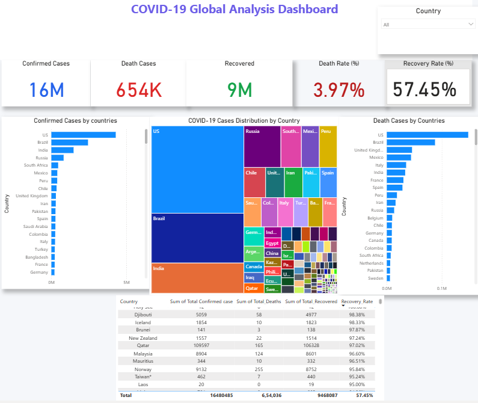

# COVID-19 Global Analysis Dashboard

## Project Overview

This project presents an interactive COVID-19 Global Analysis Dashboard developed using Power BI. The dashboard provides insights into confirmed cases, deaths, recoveries, recovery rates, and death rates across different countries through interactive visualizations and KPI metrics.

## Dashboard Preview

## Tools & Technologies

* Power BI
* Power Query
* DAX
* CSV Dataset

## Dashboard Features

* KPI Cards for Confirmed Cases, Deaths, Recovered Cases, Recovery Rate, and Death Rate
* Interactive Country Slicer
* Country-wise Analysis
* Treemap Visualization
* Comparative Bar Charts
* Summary Table

## Key Insights

* Analyzed global COVID-19 trends.
* Compared country-wise confirmed, recovered, and death cases.
* Calculated recovery and death rates using DAX measures.
* Built an interactive dashboard for data exploration.

## Skills Demonstrated

* Data Visualization
* Dashboard Design
* Data Cleaning
* Data Transformation
* DAX
* Business Intelligence

## Author

Niraj Yadav
